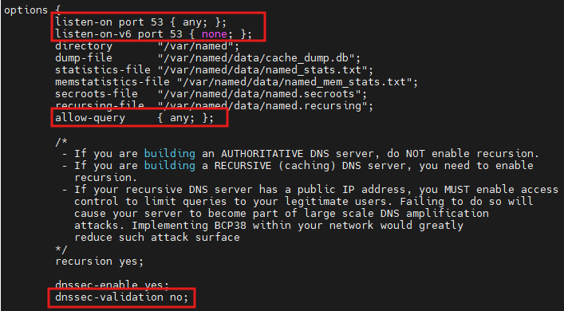
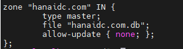
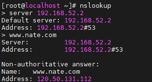
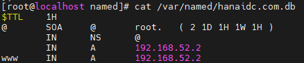
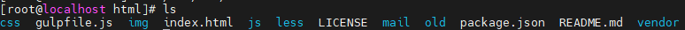

### 실습 환경
| hostname | 공인 IP | 사설 IP | domain| OS |
|-----------|--------|----------|--------|------|
|dns|115.21.73.7/25|192.168.52.2/16|hanaidc.com|RHEL-8.9|

<br>

---

### 1️⃣ 네임서버 설치 및 관련 설정 진행

1. 패키지 설치
   ```
   yum install bind bind-utils
   ```


2. `/etc/named.conf` 파일 수정
   - DNS 서버의 전체 동작 방식, 영역(zone), 접근 제어 등을 설정하는 메인 설정 파일
   
   

   

     - ipv4용 53번 포트 수신 허용 / ipv6 비활성화
     - 외부 누구나 질의 가능
     - `DNSSEC` 응답 검증 하지 않음
       - Domain Name System Security Extensions: DNS의 위변조 방지 및 무결성 검증을 위한 보안 확장 기능

3. 문법 체크
   ```
   named-checkconf
   ```

   
4. 서비스 활성화
   ```
   systemctl restart named
   systemctl enable named
   systemctl status named
   ```

5. 네임서버 작동 테스트
   
   

---

### 2️⃣ 마스터 네임서버 설정 및 운영
1. /var/named/ecore.com.db 파일 생성

   

2. 적용
```
systemctl restart named
```

<br>

### 3️⃣ 간단한 html 파일 생성
```
cd /var/www/html/

vi index.html

cat index.html
<h1> Hello, My name is ssu </h1>
```

- 테스트

 

<br>

---

<br>

## 나만의 사이트 생성하기

💡 [레포지토리](https://github.com/suhyeonkang-ecore/suhyeonkang-ecore.github.io) 내의 파일 참고

```
[root@localhost ~]# tree
.
├── rhel-8.9-x86_64-dvd.iso
└── suhyeonkang-ecore.github.io
    ├── index.html
    └── startbootstrap-freelancer-gh-pages
        ├── css
        │   ├── freelancer.css
        │   └── freelancer.min.css
        ├── gulpfile.js
        ├── img
        │   ├── portfolio
        │   │   ├── cabin.png
        │   │   ├── cake.png
        │   │   ├── circus.png
        │   │   ├── game.png
        │   │   ├── safe.png
        │   │   └── submarine.png
        │   ├── profile2.png
        │   └── profile.png
        ├── index.html
        ├── js
        │   ├── contact_me.js
        │   ├── freelancer.js
        │   ├── freelancer.min.js
        │   └── jqBootstrapValidation.js
        ├── less
        │   ├── freelancer.less
        │   ├── mixins.less
        │   └── variables.less
        ├── LICENSE
        ├── mail
        │   └── contact_me.php
        ├── package.json
        ├── README.md
        └── vendor
            ├── bootstrap
            │   ├── css
            │   │   ├── bootstrap.css
            │   │   └── bootstrap.min.css
            │   ├── fonts
            │   │   ├── glyphicons-halflings-regular.eot
            │   │   ├── glyphicons-halflings-regular.svg
            │   │   ├── glyphicons-halflings-regular.ttf
            │   │   ├── glyphicons-halflings-regular.woff
            │   │   └── glyphicons-halflings-regular.woff2
            │   └── js
            │       ├── bootstrap.js
            │       └── bootstrap.min.js
            ├── font-awesome
            │   ├── css
            │   │   ├── font-awesome.css
            │   │   └── font-awesome.min.css
            │   ├── fonts
            │   │   ├── FontAwesome.otf
            │   │   ├── fontawesome-webfont.eot
            │   │   ├── fontawesome-webfont.svg
            │   │   ├── fontawesome-webfont.ttf
            │   │   ├── fontawesome-webfont.woff
            │   │   └── fontawesome-webfont.woff2
            │   ├── less
            │   │   ├── animated.less
            │   │   ├── bordered-pulled.less
            │   │   ├── core.less
            │   │   ├── fixed-width.less
            │   │   ├── font-awesome.less
            │   │   ├── icons.less
            │   │   ├── larger.less
            │   │   ├── list.less
            │   │   ├── mixins.less
            │   │   ├── path.less
            │   │   ├── rotated-flipped.less
            │   │   ├── screen-reader.less
            │   │   ├── stacked.less
            │   │   └── variables.less
            │   └── scss
            │       ├── _animated.scss
            │       ├── _bordered-pulled.scss
            │       ├── _core.scss
            │       ├── _fixed-width.scss
            │       ├── font-awesome.scss
            │       ├── _icons.scss
            │       ├── _larger.scss
            │       ├── _list.scss
            │       ├── _mixins.scss
            │       ├── _path.scss
            │       ├── _rotated-flipped.scss
            │       ├── _screen-reader.scss
            │       ├── _stacked.scss
            │       └── _variables.scss
            └── jquery
                ├── jquery.js
                └── jquery.min.js
```




- `index.html` 파일은 필요 부분만 수정하였음

  
