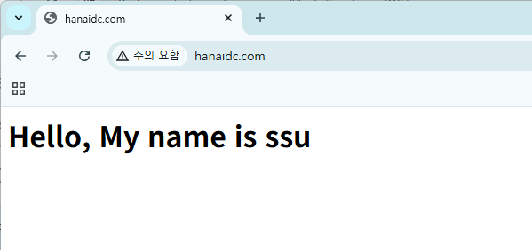

### 실습 환경
| hostname | 공인 IP | 사설 IP | domain| OS |
|-----------|--------|----------|--------|------|
|dns|115.21.73.7/25|192.168.52.2/16|hanaidc.com|RHEL-8.9|

<br>

---

### 1️⃣ 네임서버 설치 및 관련 설정 진행

1. 패키지 설치
   ```
   yum install bind bind-utils
   ```


2. `/etc/named.conf` 파일 수정
   - DNS 서버의 전체 동작 방식, 영역(zone), 접근 제어 등을 설정하는 메인 설정 파일
   
   

   

     - ipv4용 53번 포트 수신 허용 / ipv6 비활성화
     - 외부 누구나 질의 가능
     - `DNSSEC` 응답 검증 하지 않음
       - Domain Name System Security Extensions: DNS의 위변조 방지 및 무결성 검증을 위한 보안 확장 기능

3. 문법 체크
   ```
   named-checkconf
   ```

   
4. 서비스 활성화
   ```
   systemctl restart named
   systemctl enable named
   systemctl status named
   ```

5. 네임서버 작동 테스트
   
   

---

### 2️⃣ 마스터 네임서버 설정 및 운영
1. /var/named/ecore.com.db 파일 생성

   

2. 적용
```
systemctl restart named
```

3️⃣ 간단한 html 파일 생성
```
cd /var/www/html/

vi index.html

cat index.html
<h1> Hello, My name is ssu </h1>
```

- 테스트

 

 

  
4️⃣

5️⃣
